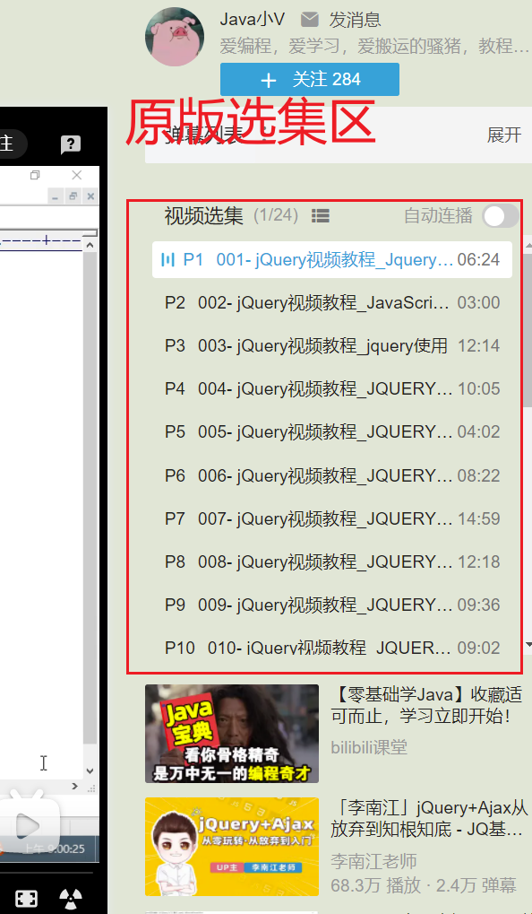
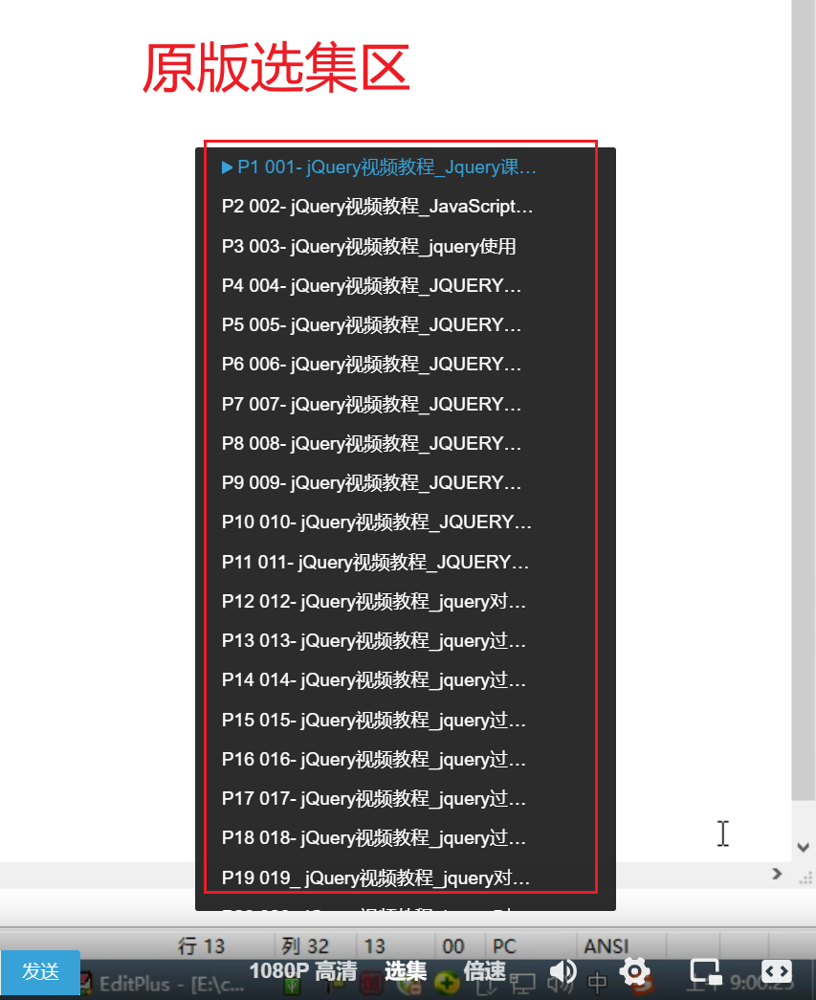
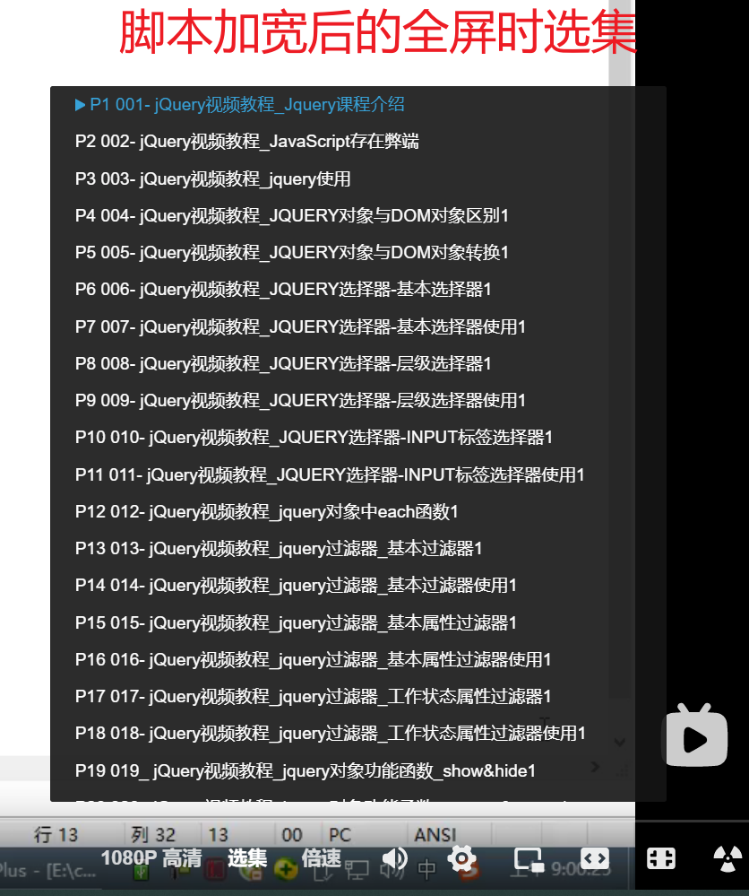

# *哔哩哔哩（bilibili | B站）多p 视频选集区标题显示加宽*

## 简介

b站多p 视频选集的时候，遇到长标题有相同前缀占用太多内容，宽度不够。虽然鼠标悬停时可以看到完整标题，但是分p太多的时候，又想要跳着看，这样仍然浪费时间，手也累，故开发此脚本，自动增加宽度。

常规播放、宽屏播放、网页全屏播放、全屏播放选集列表的宽度都可以自动增加

如果觉得宽度不够或者过大了 自己可以编辑脚本开头的 CONFIG_WIDTH = '500px' , 把 500 改成自己想要的数字

------

## 截图

 -

------

## 版本记录
#### v0.6

新增合集列表显示加高，修复了有封面的合集没有加宽的问题

#### v0.5

支持2023年新版播放器的合集列表标题显示加宽

#### v0.4

修复 2023年新版播放页失效的问题

#### v0.3

修复打开非多p视频页面浏览器控制台报错的问题

#### v0.2

1、修复网页全屏或全屏播放时切p后选集列表宽度复原的bug,；

2、提高性能

#### v0.1

常规播放、宽屏播放、网页全屏播放、全屏播放选集列表的宽度自动增加